# Vader Vocoder PWA

A Progressive Web App that transforms your voice into a Darth Vader-like effect using real-time audio processing with the Web Audio API.


## Features

### 🎙️ Real-Time Voice Processing
- **Live microphone input** with configurable device selection
- **Real-time audio effects** processing with minimal latency
- **Multiple output devices** support (where browser supports setSinkId)
- **Separate input/output volume controls** to prevent feedback
- **Independent mute buttons** for input and output
- **Device type detection** with color-coded indicators (wired, wireless, Bluetooth, built-in)

### 🎛️ Advanced Audio Controls
- **10-Band Graphic EQ** - Precise frequency control (31Hz-16kHz) with visual spectrum analyzer
- **Software Mixer** - 4-channel mixer with faders, mute, solo, and real-time level metering
- **Master Gain** - Overall volume control
- **Wet/Dry Mix** - Balance between processed and original audio
- **Multi-band EQ** - 4-band parametric equalizer (250Hz, 600Hz, 1.2kHz, 2.5kHz)
- **Filters** - Lowpass, highpass, and bandpass filtering
- **Distortion** - Waveshaping for that classic Vader growl
- **Vibrato** - Adjustable depth and rate for voice modulation
- **Robot Effect** - Ring modulation for mechanical voice tones
- **Reverb** - Convolution reverb for spatial depth
- **Compressor** - Dynamic range control with adjustable threshold
- **Noise Gate** - Automatic silence detection and gating
- **Breathing Effects** - Synthetic breathing sounds with auto-trigger

### 🎯 Preset System
- **Vader Classic** - The iconic Darth Vader sound
- **Imperial Intercom** - Communications system effect
- **Bounty Hunter** - Mandalorian-style voice modulation
- **Custom Presets** - Save and load your own configurations

### 📱 PWA Features
- **Installable** - Add to home screen on mobile devices
- **Offline Ready** - Service worker for offline functionality
- **Responsive Design** - Works on desktop, tablet, and mobile
- **Device Auto-Detection** - Automatic audio device enumeration
- **Auto Feedback Prevention** - Detects and prevents audio feedback loops
- **Diagnostic Tools** - Built-in Bluetooth and audio troubleshooting

### 🌐 Cross-Platform Support
- **📱 Android** - Optimized for Samsung, Pixel, and other Android devices with audio routing
- **🍎 iOS** - Full support for iPhone and iPad with AirPods compatibility
- **🐧 Linux** - PulseAudio and PipeWire compatibility with detailed troubleshooting
- **🍓 Raspberry Pi** - Performance-tuned for ARM processors with USB audio support
- **🪟 Windows** - Full desktop support with headset mic detection and workarounds
- **🍎 macOS** - Native macOS compatibility

## File Structure

```
Vader-Vocoder-PWA/
├── README.md              # This documentation file
├── index.html             # Main HTML file
├── app.js                 # Core application logic
├── style.css              # Styling and responsive design
├── manifest.webmanifest   # PWA manifest for installation
├── sw.js                  # Service worker for offline functionality
├── LICENSE                # MIT license
└── icons/                 # PWA icons directory
    ├── icon-192.png       # 192x192 icon
    └── icon-512.png       # 512x512 icon
```

## Installation & Setup

### Quick Start
1. **Clone or download** this repository
2. **Serve the files** using a local web server (required for microphone access)
3. **Open in browser** and grant microphone permissions
4. **Select devices** and click "Start"

### Local Development Server
```bash
# Using Python 3
python -m http.server 5500

# Using Node.js (http-server)
npx http-server -p 5500

# Using PHP
php -S localhost:5500
```

### Browser Requirements
- **Chrome/Edge**: Full support including output device selection
- **Firefox**: Core functionality (no output device selection)
- **Safari**: Core functionality with some limitations
- **Mobile browsers**: Supported with touch-optimized interface

### 📱 Mobile Installation

#### 🤖 Android Installation (Samsung S22 Ultra & Other Devices)

**Installing as PWA**
1. **Open Chrome** on your Android device
2. **Navigate** to the Vader Vocoder URL
3. **Tap the menu** (three dots) → "Add to Home screen" or "Install app"
4. **Grant permissions** when prompted for microphone access
5. **Launch** from your home screen like a native app

**Android-Specific Setup**
- **Microphone Permission**: The app will automatically request microphone access on first load
- **Device Detection**: After granting permission, you'll see actual device names instead of "default"
- **Bluetooth Audio**: Pair your Bluetooth headphones/speakers in Android Settings first
- **Performance**: Android devices use optimized audio constraints for better compatibility
- **Background Audio**: Keep the app in foreground for best performance
- **Auto-Updates**: The app will automatically check for GitHub updates and show an "Update Available" button

#### 🍎 iOS Installation (iPhone & iPad)

**Installing as PWA**
1. **Open Safari** on your iOS device (Chrome won't work for PWA installation)
2. **Navigate** to the Vader Vocoder URL
3. **Tap the Share button** (square with arrow up)
4. **Scroll down** and tap "Add to Home Screen"
5. **Confirm** the installation and **grant microphone permission** when prompted
6. **Launch** from your home screen - it will run in fullscreen mode

**iOS-Specific Setup**
- **Safari Required**: Only Safari can install PWAs on iOS
- **Microphone Permission**: iOS will prompt for microphone access on first use
- **Audio Optimization**: iOS devices use 44.1kHz sample rate for optimal compatibility
- **Background Limitations**: iOS may pause audio when switching apps
- **Bluetooth Support**: AirPods and other Bluetooth devices work seamlessly

#### 🐧 Linux Installation (Desktop & Laptop)

**Installing as PWA**
1. **Open Chrome or Chromium** on your Linux system
2. **Navigate** to the Vader Vocoder URL
3. **Click the install icon** in the address bar (⊕ or computer icon)
   - Or go to Menu (⋮) → "Install Vader Vocoder..."
4. **Grant microphone permission** when prompted
5. **Launch** from your application menu or desktop

**Linux-Specific Setup**
- **Browser Support**: Chrome/Chromium recommended for full PWA support
- **Audio Server**: Works with PulseAudio, PipeWire, or ALSA
- **Microphone Permission**: Browser will request microphone access on first use
- **Audio Quality**: Uses 48kHz sample rate with 20ms latency
- **Device Selection**: Full support for USB audio interfaces and Bluetooth devices

**Audio Configuration**
```bash
# Check available audio devices
$ aplay -l                    # List ALSA playback devices
$ arecord -l                  # List ALSA capture devices

# PulseAudio configuration
$ pactl list sinks short      # List output devices
$ pactl list sources short    # List input devices
$ pactl set-default-sink <sink-name>    # Set default output
$ pactl set-default-source <source-name> # Set default input

# Reduce audio latency (optional)
$ pactl set-sink-latency-msec <sink> 20

# PipeWire configuration (if using PipeWire)
$ pw-cli list-objects Node    # List audio nodes
$ wpctl status                # Show audio status
```

**Bluetooth Audio Setup**
```bash
# Install Bluetooth support
$ sudo apt install bluez pulseaudio-module-bluetooth

# Connect Bluetooth device
$ bluetoothctl
[bluetooth]# power on
[bluetooth]# agent on
[bluetooth]# scan on
[bluetooth]# pair <MAC_ADDRESS>
[bluetooth]# trust <MAC_ADDRESS>
[bluetooth]# connect <MAC_ADDRESS>
[bluetooth]# exit

# Verify Bluetooth audio device
$ pactl list sinks | grep -i bluetooth
```

**Common Linux Audio Issues**
- **No sound**: Check `pavucontrol` (PulseAudio Volume Control) for proper routing
- **High latency**: Adjust PulseAudio latency settings
- **Crackling audio**: Increase buffer size in `/etc/pulse/daemon.conf`
- **Permission denied**: Add user to `audio` group: `sudo usermod -aG audio $USER`

#### 🍓 Raspberry Pi Installation

**Installing as PWA**
1. **Open Chromium** on your Raspberry Pi
2. **Navigate** to the Vader Vocoder URL
3. **Click Menu (⋮)** → "Install Vader Vocoder..."
4. **Grant microphone permission** when prompted
5. **Launch** from the application menu

**Raspberry Pi-Specific Setup**
- **Recommended**: Raspberry Pi 3B+ or newer for best performance
- **Audio Interface**: USB audio interface strongly recommended over built-in audio
- **Sample Rate**: Uses 44.1kHz with 30ms latency for stability
- **CPU Usage**: Monitor with `htop` - reduce reverb/distortion if needed
- **Cooling**: Ensure adequate cooling for sustained audio processing

**Audio Configuration**
```bash
# Install required packages
$ sudo apt update
$ sudo apt install pulseaudio pavucontrol

# For Bluetooth support
$ sudo apt install bluez pulseaudio-module-bluetooth pi-bluetooth

# Enable audio
$ sudo raspi-config
# Navigate to: System Options → Audio → Select audio output

# Check audio devices
$ aplay -l
$ pactl list sinks short

# Set USB audio as default (if using USB interface)
$ pactl set-default-sink alsa_output.usb-<device-name>
```

**Optimize for Raspberry Pi**
```bash
# Edit /boot/config.txt for better audio
$ sudo nano /boot/config.txt

# Add or modify these lines:
dtparam=audio=on
audio_pwm_mode=2              # Better audio quality
disable_audio_dither=1        # Reduce noise

# For USB audio, add:
dtoverlay=dwc2

# Reboot after changes
$ sudo reboot
```

**Performance Tips for Raspberry Pi**
- **Use USB Audio**: Built-in audio has limited quality
- **Reduce Effects**: Lower reverb and distortion settings if CPU usage is high
- **Close Other Apps**: Free up CPU resources for audio processing
- **Use Lite OS**: Raspberry Pi OS Lite uses less resources
- **Overclock Safely**: Consider mild overclocking for Pi 3/4 (with cooling)
- **Power Supply**: Use official power supply to prevent audio glitches

**Recommended USB Audio Interfaces for Pi**
- **Budget**: Sabrent USB External Stereo Sound Adapter
- **Mid-range**: Behringer UCA202 U-Control
- **Quality**: Focusrite Scarlett Solo (requires powered USB hub)
- **Pro**: Steinberg UR22C (requires powered USB hub)

## 🔄 Getting Updates from GitHub

### **How PWA Updates Work**
When you install the PWA on your device, it creates a cached version. GitHub updates don't automatically sync, but the app includes an update system:

### **Automatic Update Detection**
1. **Open your installed PWA** - it checks for updates in the background
2. **Look for "Update Available" button** - appears in the header when updates are found
3. **Click "Update Available"** - instantly updates to the latest GitHub version
4. **Check status log** - shows "Ready to start vocoding! Version 2.1" with latest features

### **Manual Update Methods**

#### **Method 1: Use Update Button (Recommended)**
- Open your installed PWA and look for the **"Update Available"** button
- Click it to instantly get the latest version from GitHub

#### **Method 2: Refresh Cache**
1. Open the PWA and check the **Status section** at the bottom
2. Look for update messages or version numbers
3. If no update detected, try closing and reopening the app

#### **Method 3: Clear Cache (If stuck on old version)**
1. **Android**: Long press PWA icon → App info → Storage & cache → Clear cache
2. **iOS**: Settings → Safari → Clear History and Website Data (affects all sites)

#### **Method 4: Reinstall PWA**
1. **Uninstall** current PWA from home screen
2. **Visit GitHub Pages URL** in browser
3. **Reinstall** fresh copy with latest updates

### **Checking Your Version**
- Open the PWA and check the **Status log** at the bottom
- Latest version shows: *"Ready to start vocoding! Version 2.1 with mobile optimizations"*

## Usage

### Basic Operation
1. **Grant Permissions**: Allow microphone access when prompted
2. **Select Devices**: Choose your microphone and output device
3. **Choose Preset**: Start with "Vader Classic" for the iconic sound
4. **Click Start**: Begin real-time voice processing
5. **Adjust Controls**: Fine-tune the effect parameters

### Advanced Configuration
- **Latency Hint**: Choose between "interactive", "balanced", or "playback"
- **Custom EQ**: Adjust individual frequency bands for your voice
- **Effect Mixing**: Balance wet/dry signals for subtle or dramatic effects
- **Breathing Control**: Configure automatic breathing between speech

### Using the Graphic EQ
The 10-band graphic equalizer provides precise frequency control:
- **31Hz-125Hz** - Sub-bass and bass frequencies (add depth and rumble)
- **250Hz-500Hz** - Low-midrange (body and warmth)
- **1kHz-2kHz** - Midrange (vocal clarity and presence)
- **4kHz-8kHz** - Upper frequencies (brightness and articulation)
- **16kHz** - Air and sparkle

**EQ Presets:**
- **Flat** - All bands at 0dB (neutral)
- **Vocal Boost** - Enhanced midrange for clearer voice
- **Bass Boost** - Increased low frequencies for deeper sound
- **Reset** - Return all bands to 0dB

**Visual Spectrum Analyzer:**
- **Always-On Display** - Starts immediately when you open the app
- **Real-Time Visualization** - Shows frequency spectrum as you speak
- **Setup Configuration** - See your microphone input before starting the vocoder
- **Troubleshooting Tool** - Verify your mic is working and capturing audio
- **Color-Coded Bars** - Visual feedback of audio levels across all frequencies
- **Grid Markers** - Shows the 10 EQ band positions for reference

**Pro Tip**: Use the spectrum analyzer to check if your microphone is working before clicking Start. You should see the bars moving when you speak!

### Using the Software Mixer
The 4-channel mixer provides professional mixing capabilities:

**Channels:**
- **🎤 Input** - Raw microphone signal level
- **🎸 Effects** - Processed effects chain level
- **💨 Breath** - Breathing sound effects level
- **🔊 Master** - Final output level

**Controls:**
- **Faders** - Adjust channel levels from 0-200%
- **M (Mute)** - Silence individual channels
- **S (Solo)** - Listen to one channel exclusively
- **Level Meters** - Real-time visual feedback (green→yellow→red)

**Workflow Tips:**
1. Set input fader to capture good signal level
2. Balance effects vs dry signal
3. Adjust breath volume to taste
4. Use master fader for final output level
5. Use solo to isolate and fine-tune individual channels

### Tips for Best Results
- **Use a headset** or helmet microphone to prevent feedback
- **Bluetooth speakers** work great for output (pair at OS level first)
- **Close microphone placement** improves the effect quality
- **Adjust noise gate** to match your speaking volume
- **Use graphic EQ** to shape your voice before effects
- **Monitor levels** on mixer meters to avoid clipping

## Technical Details

### Audio Processing Chain

```mermaid
graph LR
    A[🎤 Microphone Input] --> B[Mixer Input Channel]
    B --> C[Input Gain Control]
    C --> D[10-Band Graphic EQ<br/>31Hz-16kHz]
    D --> E[Highpass Filter]
    E --> F[Bandpass Filter]
    F --> G[Lowpass Filter]
    G --> H[4-Band Parametric EQ<br/>250Hz, 600Hz<br/>1.2kHz, 2.5kHz]
    H --> I[Mixer Effects Channel]
    I --> J[Robot AM<br/>Ring Modulation]
    J --> K[Distortion<br/>Waveshaper]
    K --> L[Vibrato<br/>LFO + Delay]
    L --> M{Wet/Dry Mix}
    M --> N[Reverb<br/>Convolution]
    M --> O[Dry Signal]
    N --> P[Mix Bus]
    O --> P
    P --> Q[Noise Gate]
    Q --> R[Compressor]
    R --> S[Master Gain]
    S --> T[Mixer Master Channel]
    T --> U[Output Gain Control]
    U --> V[🔊 Audio Output]
    
    style A fill:#4CAF50
    style D fill:#2196F3
    style H fill:#FF9800
    style J fill:#9C27B0
    style K fill:#F44336
    style Q fill:#FFC107
    style T fill:#00BCD4
    style V fill:#2196F3
```



### Mixer Architecture

```mermaid
graph TB
    subgraph "Software Mixer"
        A[🎤 Input Channel] --> M[Mixer Bus]
        B[🎸 Effects Channel] --> M
        C[💨 Breath Channel] --> M
        M --> D[🔊 Master Channel]
    end
    
    subgraph "Channel Controls"
        A1[Input Fader<br/>0-200%] --> A
        A2[Mute Button] --> A
        A3[Solo Button] --> A
        A4[Level Meter] -.-> A
        
        B1[Effects Fader<br/>0-200%] --> B
        B2[Mute Button] --> B
        B3[Solo Button] --> B
        B4[Level Meter] -.-> B
        
        C1[Breath Fader<br/>0-200%] --> C
        C2[Mute Button] --> C
        C3[Solo Button] --> C
        C4[Level Meter] -.-> C
        
        D1[Master Fader<br/>0-200%] --> D
        D2[Master Meter] -.-> D
    end
    
    D --> E[Audio Output]
    
    style A fill:#4CAF50
    style B fill:#FF9800
    style C fill:#2196F3
    style D fill:#F44336
    style E fill:#9C27B0
```



### Graphic EQ Frequency Response


### System Architecture


### Application Flow


### Diagnostic & Troubleshooting Flow

```mermaid
graph TD
    A[User Clicks Diagnose BT] --> B[Detect Platform]
    B --> C{Platform Type?}
    
    C -->|Windows| D[Check for Headsets]
    D --> E{Headset with Mic?}
    E -->|Yes| F[⚠️ Show Headset Warning]
    F --> G[Provide Solutions:<br/>1. Use separate mic<br/>2. Sound settings<br/>3. VoiceMeeter]
    E -->|No| H[Show Device List]
    
    C -->|Android| I[Check Bluetooth]
    I --> J[Show Mobile Devices]
    J --> K[Provide Android Tips]
    
    C -->|iOS| L[Check AirPods]
    L --> M[Show iOS Devices]
    M --> N[Provide iOS Tips]
    
    C -->|Linux| O[Check Audio Server]
    O --> P[Show ALSA/PulseAudio]
    P --> Q[Provide Terminal Commands]
    
    C -->|Raspberry Pi| R[Check USB Audio]
    R --> S[Show Pi Devices]
    S --> T[Provide Pi Optimization]
    
    G --> U[Display Results]
    H --> U
    K --> U
    N --> U
    Q --> U
    T --> U
    
    style F fill:#FF9800
    style G fill:#4CAF50
    style U fill:#2196F3
```



### Platform-Specific Audio Routing


### Key Technologies
- **Web Audio API** - Real-time audio processing
- **MediaDevices API** - Microphone and device access
- **Service Workers** - Offline functionality and caching
- **Web App Manifest** - PWA installation and theming

### Performance Optimizations
- **Efficient audio graph** with minimal processing overhead
- **Smart device handling** with automatic fallbacks
- **Memory management** with proper cleanup on stop/restart
- **Browser compatibility** layers for cross-platform support
- **Platform-specific tuning** for Android, iOS, Linux, and Raspberry Pi

## File Structure

```
vader-vocoder-pwa/
├── vader-pwa/
│   ├── index.html          # Main application interface
│   ├── app.js              # Core audio processing logic
│   ├── style.css           # Application styling
│   ├── sw.js               # Service worker for PWA features
│   ├── manifest.webmanifest # PWA manifest
│   └── icons/              # Application icons
│       ├── icon-192.png
│       └── icon-512.png
└── README.md               # This file
```

## Troubleshooting

### Audio Cuts Out or Won't Restart
- **Recent Fix**: Improved AudioContext state management and oscillator cleanup
- **Try**: Refresh the page and restart the application
- **Check**: Browser console for specific error messages

### No Microphone Access
- **Ensure HTTPS**: Microphone requires secure context (https:// or localhost)
- **Check Permissions**: Browser may have blocked microphone access
- **Try Different Browser**: Some browsers have stricter policies

### Poor Audio Quality
- **Reduce Latency**: Set latency hint to "interactive"
- **Check Device**: Ensure microphone is working properly
- **Adjust Levels**: Lower master gain if distorting

### Device Selection Issues
- **Refresh Devices**: Click the refresh button (↻) to update device list
- **Browser Support**: Output device selection requires Chrome/Edge
- **OS Pairing**: Bluetooth devices must be paired at system level first

### 🤖 Android-Specific Troubleshooting

#### "Only Default Device" Issue
- **Grant Permission First**: The app automatically requests microphone permission on load
- **Check Status Log**: Look for "Microphone permission granted" in the status section
- **Refresh After Permission**: Click the refresh button (↻) after granting permission
- **Chrome Required**: Use Chrome browser for best Android compatibility

#### Samsung S22 Ultra Specific
- **Multiple Microphones**: Your device has multiple mics - choose the one that works best
- **Bluetooth Priority**: Samsung devices prioritize Bluetooth audio when connected
- **Performance Mode**: Enable "High Performance" in battery settings for better audio processing
- **Do Not Disturb**: Disable DND mode as it can interfere with audio permissions

#### General Android Issues
- **Background Limits**: Keep the app in foreground to prevent audio interruption
- **Battery Optimization**: Disable battery optimization for Chrome if audio cuts out
- **Storage Permission**: Ensure Chrome has storage access for PWA installation
- **Clear Cache**: Clear Chrome cache if device detection fails repeatedly

### 🍎 iOS-Specific Troubleshooting

#### PWA Installation Issues
- **Safari Only**: PWA installation only works in Safari, not Chrome or other browsers
- **Share Button**: Look for the share button (square with up arrow) in Safari's toolbar
- **iOS Version**: Requires iOS 11.3+ for PWA support
- **Storage Space**: Ensure sufficient storage for PWA installation

#### iPhone/iPad Audio Issues
- **Microphone Permission**: Check Settings → Privacy & Security → Microphone → Safari
- **Silent Mode**: Disable silent/mute switch - it can affect audio processing
- **Background App**: iOS may pause audio when switching apps - keep app in foreground
- **AirPods/Bluetooth**: Works great with AirPods - they'll show up in device selection
- **Sample Rate**: iOS automatically uses 44.1kHz for optimal compatibility

#### Device Detection Problems
- **Permission First**: Grant microphone permission before device names appear
- **Refresh Needed**: Tap refresh (↻) button after connecting/disconnecting devices
- **Limited Selection**: iOS may show fewer device options than Android
- **Default Fallback**: If no devices show, "Default" will use the system's preferred audio

### 🐧 Linux-Specific Troubleshooting

#### Audio Server Issues
- **PulseAudio Not Running**: Start with `pulseaudio --start` or `systemctl --user start pulseaudio`
- **PipeWire Conflicts**: Ensure PipeWire-pulse is running if using PipeWire
- **ALSA Direct Access**: May conflict with PulseAudio - use PulseAudio for best results
- **Check Audio Server**: Run `pactl info` to verify PulseAudio is running

#### Device Detection Problems
- **No Devices Listed**: Run `pactl list sinks` and `pactl list sources` to verify devices
- **Permission Denied**: Add user to audio group: `sudo usermod -aG audio $USER` (logout/login required)
- **USB Audio Not Detected**: Check `dmesg | grep -i audio` for USB device recognition
- **Bluetooth Not Working**: Ensure `pulseaudio-module-bluetooth` is installed

#### Audio Quality Issues
- **Crackling/Popping**: Increase buffer size in `/etc/pulse/daemon.conf`:
  ```
  default-fragments = 4
  default-fragment-size-msec = 25
  ```
- **High Latency**: Reduce latency with `pactl set-sink-latency-msec <sink> 20`
- **Choppy Audio**: Check CPU usage with `htop` - close unnecessary applications
- **Distorted Sound**: Lower master gain and check PulseAudio volume levels

#### Browser-Specific Issues
- **Chrome/Chromium**: Best support for PWA and audio device selection
- **Firefox**: Limited device selection support, but core functionality works
- **Permissions**: Check `chrome://settings/content/microphone` for site permissions
- **Clear Cache**: Clear browser cache if experiencing persistent issues

#### Common Commands for Troubleshooting
```bash
# Check audio system status
$ pactl info                          # PulseAudio info
$ systemctl --user status pulseaudio  # PulseAudio service status

# List all audio devices
$ pactl list sinks                    # Output devices (detailed)
$ pactl list sources                  # Input devices (detailed)
$ aplay -l                            # ALSA playback devices
$ arecord -l                          # ALSA capture devices

# Test audio
$ speaker-test -t wav -c 2            # Test speakers
$ arecord -f cd -d 5 test.wav         # Test microphone (5 seconds)
$ aplay test.wav                      # Play back recording

# Reset PulseAudio
$ pulseaudio -k                       # Kill PulseAudio
$ pulseaudio --start                  # Restart PulseAudio

# Check for errors
$ journalctl --user -u pulseaudio     # PulseAudio logs
$ dmesg | grep -i audio               # Kernel audio messages
```

### 🪟 Windows-Specific Troubleshooting

#### Headset with Microphone Issues
**Problem**: When using a headset with a built-in microphone, Windows locks the microphone and headset speakers together, preventing you from using separate speakers for output.

**Why This Happens**: Windows treats headsets as a single "communications device" and automatically routes both input and output through the same device.

**Solutions**:

1. **Use a Separate Microphone (Recommended)**
   - Get a USB microphone or desktop microphone
   - This completely solves the issue
   - Allows any speaker/headphone for output
   - Better microphone quality

2. **Windows Sound Settings Workaround**
   - Right-click speaker icon → Sound Settings
   - Set different default playback device
   - Keep headset mic as recording device
   - May not work with all headsets

3. **Communications Device Separation**
   - Control Panel → Sound → Communications tab
   - Set different devices for default and communications

4. **Virtual Audio Routing**
   - **VoiceMeeter** (free virtual audio mixer)
   - **VB-Audio Virtual Cable** for audio routing
   - More complex but gives full control

**Detection**: The diagnostic tool (🔍 Diagnose BT button) automatically detects headsets with microphones and provides specific guidance.

### 🍓 Raspberry Pi-Specific Troubleshooting

#### Performance Issues
- **High CPU Usage**: Check with `htop` - reduce reverb and distortion settings
- **Audio Stuttering**: Close other applications to free CPU resources
- **Overheating**: Ensure adequate cooling - add heatsinks or fan
- **Slow Response**: Use Raspberry Pi 3B+ or newer for best performance
- **Memory Issues**: Close Chromium tabs and other applications

#### Audio Hardware Problems
- **Built-in Audio Poor Quality**: Use USB audio interface instead
- **No Sound from USB**: Check `aplay -l` to verify USB device is detected
- **USB Device Not Recognized**: Try different USB port or powered USB hub
- **Audio Crackling**: Use official power supply - insufficient power causes audio issues
- **Headphone Jack Issues**: Built-in jack has limited quality - USB audio recommended

#### Configuration Issues
- **Wrong Audio Output**: Run `sudo raspi-config` → System Options → Audio
- **USB Audio Not Default**: Set with `pactl set-default-sink alsa_output.usb-<device>`
- **Bluetooth Pairing Fails**: Ensure `pi-bluetooth` package is installed
- **Permission Denied**: Add user to audio group: `sudo usermod -aG audio pi`

#### Optimization Tips
```bash
# Check current audio configuration
$ cat /boot/config.txt | grep audio

# Monitor CPU usage while running
$ htop

# Check temperature (should stay below 80°C)
$ vcgencmd measure_temp

# Check power supply voltage (should be ~5V)
$ vcgencmd get_throttled
# 0x0 = good, anything else = power issues

# Disable unnecessary services
$ sudo systemctl disable bluetooth    # If not using Bluetooth
$ sudo systemctl disable cups         # If not using printer

# Optimize Chromium for performance
# Launch with: chromium-browser --disable-gpu --disable-software-rasterizer
```

#### Recommended Raspberry Pi Setup
- **Model**: Raspberry Pi 4 (4GB+ RAM) or Pi 3B+ minimum
- **OS**: Raspberry Pi OS (32-bit or 64-bit)
- **Audio**: USB audio interface (not built-in jack)
- **Cooling**: Heatsinks + fan for sustained use
- **Power**: Official Raspberry Pi power supply (5V 3A for Pi 4)
- **Browser**: Chromium (pre-installed on Raspberry Pi OS)

## Development

### Recent Improvements (v4.3)
- ✅ **10-Band Graphic EQ** - Professional frequency control with visual spectrum analyzer
- ✅ **Always-On EQ Visualization** - Spectrum analyzer starts immediately for setup configuration
- ✅ **Software Mixer** - 4-channel mixer with faders, mute, solo, and real-time metering
- ✅ **Windows Headset Detection** - Automatic detection and troubleshooting for headset mic issues
- ✅ **Separate Input/Output Volume Controls** - Independent volume sliders to prevent feedback
- ✅ **Device Type Detection** - Color-coded indicators for wired, wireless, Bluetooth devices
- ✅ **Auto Feedback Prevention** - Detects and prevents audio feedback loops
- ✅ **Mute Controls** - Individual mute buttons for input and output
- ✅ **Test Audio Function** - Test output without starting full vocoder
- ✅ **Speaker Permission Button** - Explicit Bluetooth speaker access
- ✅ **Diagnostic Tools** - Built-in audio troubleshooting for Windows, Linux, Raspberry Pi, Android, iOS
- ✅ **Linux & Raspberry Pi Support** - Optimized for PulseAudio, PipeWire, and ARM processors
- ✅ **Fixed AudioContext state management** - Proper cleanup and recreation
- ✅ **Enhanced error handling** - Graceful fallbacks for device failures
- ✅ **Improved oscillator lifecycle** - Prevents "already started" errors
- ✅ **Browser autoplay policy support** - Automatic AudioContext resumption
- ✅ **Device change detection** - Automatic device list updates
- ✅ **Stream health monitoring** - Detects device disconnection

### Contributing
1. Fork the repository
2. Create a feature branch
3. Test thoroughly across browsers
4. Submit a pull request

## License

This project is open source. Feel free to use, modify, and distribute.

## Credits

Built with the Web Audio API and modern web standards. Inspired by the iconic voice of Darth Vader from Star Wars.

---

*"The Force is strong with this one."* - Use responsibly and have fun! 🎭
